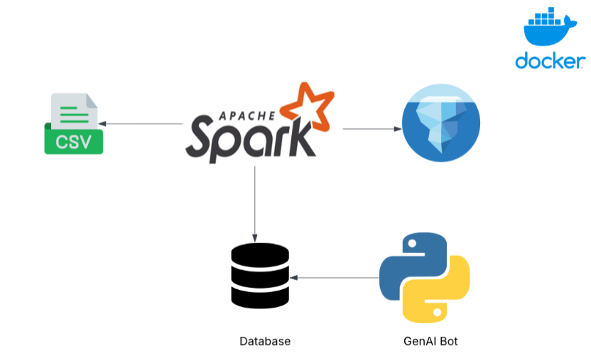

# ETL Pipeline with Apache Spark and Iceberg with GenAI Bot

This project provides a simple ETL (Extract, Transform, Load) pipeline that:

- **Extracts** data from CSV files
- **Transforms** it using Apache Spark
- **Loads** it into Apache Iceberg tables

The pipeline is implemented in **Jupyter Notebooks** and fully **Dockerized** for easy setup and reproducibility.

## Architecture



## Getting Started

Follow these steps to set up and run the project:

### Step 1: Install Docker

- **Windows**: Follow the official guide to install Docker Desktop:  
  [Docker Desktop for Windows](https://docs.docker.com/desktop/install/windows-install/)
- **macOS/Linux**: Install Docker using the official instructions:  
  [Get Docker](https://docs.docker.com/get-docker/)

### Step 2: Clone the Repository

```bash
git clone https://github.com/0xpradish/spark-iceberg-docker.git
```

### Step 3: Navigate to the Project Directory

```bash
cd Spark-Iceberg-Docker
```

### Step 4: Start the Project with Docker

```bash
docker compose up
```

This command will:

Start all required services
Launch Jupyter Notebook with Apache Spark and Iceberg support

Once the services are running, open the Jupyter Notebook URL (http://localhost:8888/) in your browser to explore the notebooks.